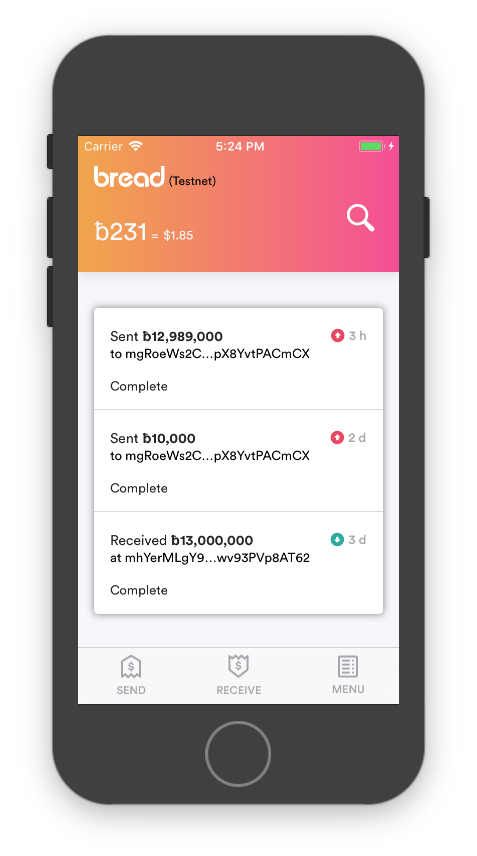

# Team 2 Homework 2 report

## A Bitcoin Cash Breadwallet

### Breadwallet

Breadwallet is a fully functional and open-source Bitcoin(BTC) wallet, and it is a very popular wallet both on iOS and Android. It has following features,

+ SPV Bitcoin wallet, no need server to deal transaction or query requests
+ Peer-to-peer(P2P) connection to blockchain networking
+ Hierarchical Deterministic(HD) key generation and management
+ Friendly BIP0039 Mnemonic Code Words for user to memory
+ passcode and iOS keychain storage protection
+ iOS Touch ID support
+ iOS Push Notification and Android GCM support (require server)

For some reasons, the official team decided not to completely support BCH. They only create a small function to swipe out all BCH.

### Bitcoin Cash

Bitcoin Cash(BCH) is a new Bitcoin-like cryptocurrency, hard-forked from Bitcoin network height 478599 on August 1, 2017 UTC.

According to Wikipedia page, BCH has serveral new features:

    - Larger Block Size
    - New Transaction Signature
    - New Difficulty Adjustment Algorithm

Breadwallet is a SPV node, so block size will not affect functions, while transaction signature and difficulty verification must be modified properly before running on BCH.

#### Bitcoin V.S Bitcoin Cash

The latest debates around Bitcoin’s technology have been concerned with this central problem of scaling and increasing the speed of the transaction verification process. There are two major solutions to this problem, either to make the amount of data that need to be verified in each block smaller, making transactions faster and cheaper or to make the blocks of data bigger, so that more information can be processed at one time.

In mid July 2017, mining pools and companies representing roughly 80-90% of Bitcoin computing power voted to incorporate a technology known as a segregated witness, called SegWit2x. SegWit2x makes the amount of data that needs to be verified in each block smaller, by removing signature data from the block of data that needs to be processed in each transaction, and having it attached in an extended block. Signature data has been estimated to account for up to 65% of data processed in each block, so this is not an insignificant technological shift. Talk of doubling the size of blocks from 1mb to 2mb in November has ramped up, and is expected.This would also go some ways in improving Bitcoin’s scalability. In mid-October, Bitcoin scientists from Bitcoin Unlimited revealed they had mined the world's first 1GB block, 1,000 times bigger than the normal size.

Bitcoin Cash is a different story. Bitcoin Cash was started by Bitcoin miners and developers equally concerned with the future of the cryptocurrency, and its ability to scale effectively. These individuals had their reservations about the adoption of a segregated witness technology, though. They felt as though SegWit2x did not address the fundamental problem of scalability in a meaningful way, nor did it follow the roadmap initially outlined by Satoshi Nakamoto, the anonymous party that first proposed the blockchain technology behind cryptocurrency. Furthermore, the process of introducing SegWit2x as the road forward was anything but transparent, and there were concerns that its introduction undermined the decentralization and democratization of the currency.

On August 1st, some miners and developers initiated what is known as a hard fork, effectively creating a new currency: Bitcoin Cash. Bitcoin Cash has implemented an increased block size of 8mb, to accelerate the verification process, with an adjustable level of difficulty to ensure the chain’s survival and transaction verification speed, regardless of the number of miners supporting it. This has raised concerns about the security of Bitcoin Cash.

### App Arch

As shown below, Breadwallet consists of several layers to decouple objects and make it more flexible and robust.

Like typical iOS Apps, the start point is AppDelegate. AppDelegate creates an ApplicationController immediately after launching. Next, ApplicationController will initiate the sequential services, such as WalletManager, Store, and Setup root view controller.

Then, Breadwallet-core is going to initiate several TCP socket connections from “DNS seed" nodes. They will become the boot-up peers, and the users will be able to send bitcoin transaction requests, like the most common P2PKH. After successful connections, breadwallet, as a typical SPV wallet, will send getHeaders requests to fetch and sync transactions information from BTC or BCH network. Once this step is done, Store will be initiated to cache these data and post signal to view controllers(subscribers of Store) to update their UI.

### Conclusion

According to studied above, it is very easy to modify this mobile app into a BCH compatible one. There are some modifications to make it BCH-compatible.

First of all, changing the default BTC dns seeds to BCH ones:

    - seed.bitcoinabc.org
    - seed-abc.bitcoinforks.org
    - seed.bitcoinunlimited.info
    - seed.bitprim.org
    - seed.deadalnix.me

Secondly, delete BRMerkleBlockVerifyDifficulty and some checkpoints in BRMerkleBlock.c to disable original BTC difficulty verification.

Finally, modify invocations of method in WalletManager.swift:

    func signTransaction(_ tx: BRTxRef, forkId: Int, pin: String)

to assign 0x40 to parameter forkID, so that new BIP-0143 "Witness Program" transaction signatures will be created for BCH network.

As a result, this modified app become an fully functional BCH wallet, except some server-dependent function like, Push Notification and exchange rate calculation. For convienience, we connect our app into testnet and request some money from faucet website. The snapshot list below.

confirmation link: [https://www.blocktrail.com/tBCC/tx/8c11b9ba0541d67aca16e8ae5d7f605a0134840cfc87401e3fede44469f8d152](https://www.blocktrail.com/tBCC/tx/8c11b9ba0541d67aca16e8ae5d7f605a0134840cfc87401e3fede44469f8d152)

### Source code repo

[https://github.com/shawnhung0714/breadwallet-ios](https://github.com/shawnhung0714/breadwallet-ios)

### Reference

+ [Bitcoin Cash - Wikipedia](https://en.wikipedia.org/wiki/Bitcoin_Cash)
+ [BitcoinCash.org](https://www.bitcoincash.org/#features)

### Staff

+ 洪軒治 - Programming, Document
+ 廖彥智 - Programming
+ 鍾明諺 - Solution discovery
+ Helen Tian - Document
+ Ting-Wei Chang
+ 吳伯威